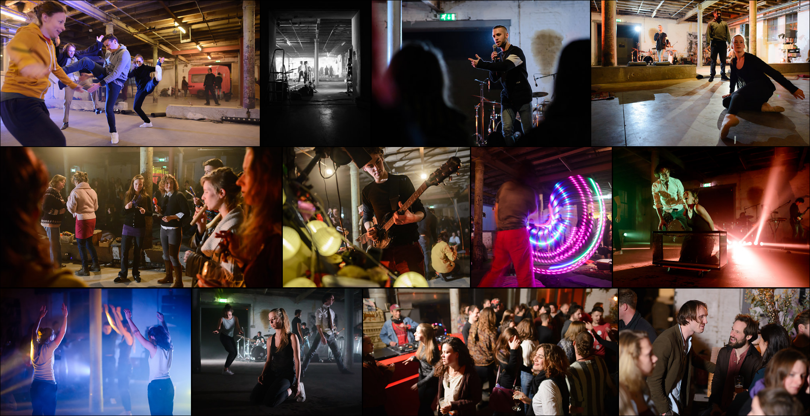

# The Happening

The Happening was a performance art festival held in 2017 in
’s-Hertogenbosch. This repository contains the source code for its
website as well as an archived copy that can be viewed on
https://happening.created.today/

## Installation

Install Python and run the following commands:

    pip install -r requirements.txt
    ./manage.py migrate
    ./manage.py createsuperuser
    ./manage.py runserver

## Usage

Visit https://localhost:8000/admin/festival/element/ to add
elements to the homepage.
